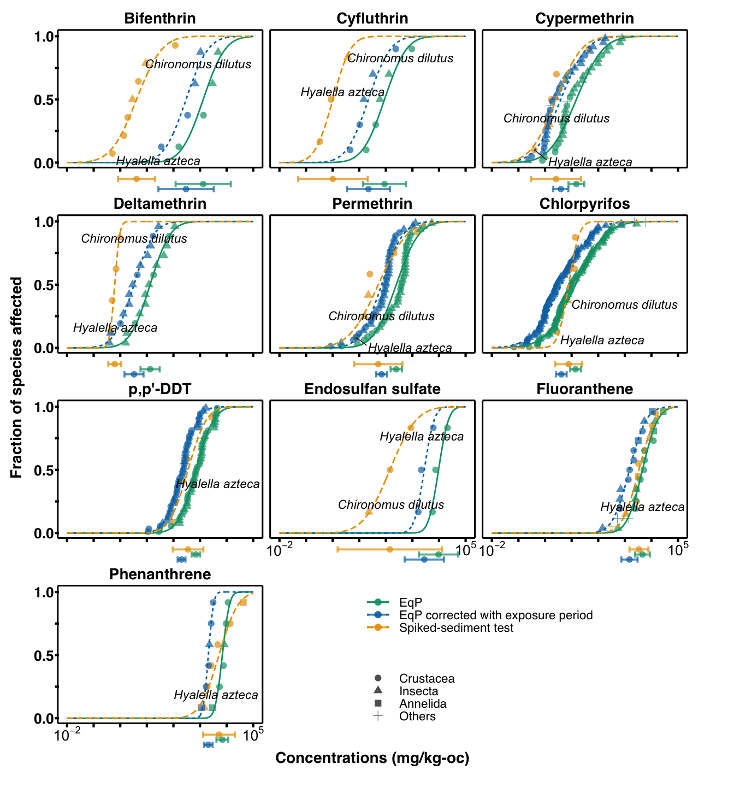
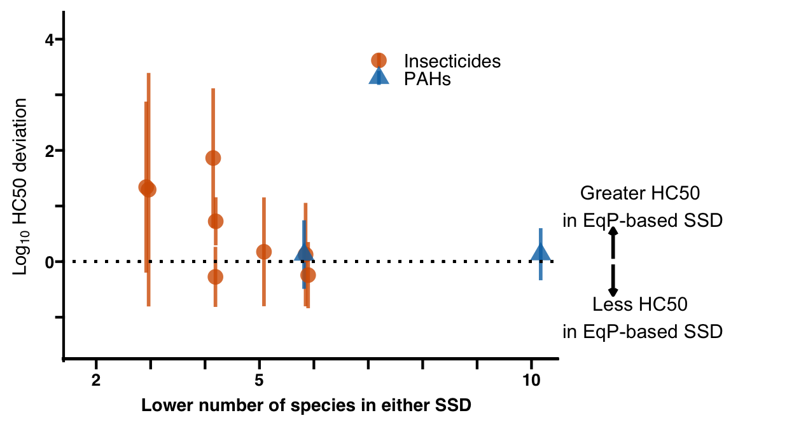

    knitr::opts_chunk$set(echo = TRUE, message=FALSE,fig.path = "figures/figure-") #echo=TRUE

    library(openxlsx)
    library(tidyverse)
    library(broom)
    library(ggplot2)
    library(cowplot)
    library(gridExtra)
    library(grid)
    library(ggExtra)
    library(ggrepel)
    library(ggpmisc)
    library(ggprism)
    library(gtable)
    library(scales)
    library(knitr)
    library(lemon)
    library(MASS)
    library(EnvStats)
    library(Rmisc)

    ## Table S1, S2よりデータ取得
    Sediment <-  read.xlsx("TablesS1_S3.xlsx",sheet="TableS1_sediment_data") 
    Water_test <-  read.xlsx("TablesS1_S3.xlsx",sheet="TableS2_water_only_data")
    Water_only_10days <- read.xlsx("TablesS1_S3.xlsx",sheet="TableS3_10day_water_only")

    #### preparation ####
    ## Water-only試験のデータの曝露期間補正
    ## さらに平衡分配法によって固相濃度に変換する
    Water_test_transformed <- Water_test %>%
      mutate_at(vars(logKow,logKoc, Days),as.numeric) %>%
      mutate(LC50_corrected = ifelse(Days<=3.99,LC50/((logKow*0.0988+0.9807)*2.56), # using DiToro's ratio
                                          ifelse(Days<=5,LC50/(2.56),LC50) )) %>%
      mutate(LC50_sediment = LC50 * (10^logKoc) ) %>%
      mutate(LC50_sediment_corrected = LC50_corrected * (10^logKoc) ) %>%
      mutate(Type="Water") %>%
      dplyr::select(-X1,-Source,-Unit,-LC50,-LC50_corrected)

    Sediment_simplified <- Sediment %>%
      dplyr::select(-X1,-Source,-Unit)

    ## WaterとSedimentのデータを統合する
    Combined <- merge( Water_test_transformed %>% dplyr::select(-LC50_sediment_corrected),
                       Sediment_simplified %>% dplyr::rename(LC50_sediment=LC50), all=TRUE)  %>%
    merge( Water_test_transformed %>% dplyr::select(-LC50_sediment) %>%
             mutate(Type="Water_corrected") %>% dplyr::rename(LC50_sediment=LC50_sediment_corrected), all=TRUE) %>%
      dplyr::select(-logKow,-logKoc)

    table(Combined$Chemical,Combined$Type)

    ##                     
    ##                      Sediment Water Water_corrected
    ##   Bifenthrin               40     8               8
    ##   Chlorpyrifos             12   146             146
    ##   Cyfluthrin                9    19              19
    ##   Cypermethrin             31    43              43
    ##   Deltamethrin              7    25              25
    ##   Endosulfan sulfate        4     4               4
    ##   Fluoranthene             40    28              28
    ##   p,p'-DDT                 13    76              76
    ##   Permethrin               26    86              86
    ##   Phenanthrene             25    18              18

     

    #### 
    Combined_SSD_species <- Combined %>% 
      group_by(Species,Chemical,Type) %>% 
      dplyr::summarize(GeoMean_LC = geoMean(LC50_sediment) ) %>%
      dplyr::mutate( chem_type = paste(!!!rlang::syms(c("Chemical", "Type")), sep="-") ) %>%
      mutate(dummy=1) %>%
      ungroup() %>%
      arrange(chem_type,GeoMean_LC) %>%
      mutate (frac=aggregate( as.numeric(.$GeoMean_LC),
                                by=list(.$dummy,.$chem_type),    #dummy入れないとうまくfrac割り振れない, 理由は謎
                                function(x) ppoints(length(x),0.5) )[,3] %>% unlist ) %>%
      mutate(Label= ifelse(Species=="Hyalella azteca","Hyalella azteca",
                           ifelse(Species=="Chironomus dilutus","Chironomus dilutus",""))) %>%
      mutate(ChemicalClass= ifelse(Chemical=="Fluoranthene" | Chemical=="Phenanthrene",
                                   "PAHs","Insecticides")) %>%
      mutate(Taxon= Combined[match(.$Species, Combined$Species),"Taxon"]) 

    # goodness-of-fit test
    fitness_sw <- aggregate(Combined_SSD_species$GeoMean_LC,
                            by=list(Combined_SSD_species$Chemical, Combined_SSD_species$Type),
                            function(x) shapiro.test(log10( as.numeric(x) ) )$p.value  ) %>%
        dplyr::rename(p_value=x) %>%
        mutate(adj_p = p.adjust(p_value,"holm"))
    fitness_sw[fitness_sw$adj_p <= 0.05]

    ## data frame with 0 columns and 30 rows

    ## all SSDs not rejected

    Combined_SSD <- Combined %>%  
      filter(!is.na (LC50_sediment) ) %>%
      merge(Combined_SSD_species, all=TRUE)

    ############# using only one test record for each species #############
    ### model fitting ####
    ## preparation for figure: regression curve

    shift_legend <- function(p){
      # check if p is a valid object
      if(!"gtable" %in% class(p)){
        if("ggplot" %in% class(p)){
          gp <- ggplotGrob(p) # convert to grob
        } else {
          message("This is neither a ggplot object nor a grob generated from ggplotGrob. Returning original plot.")
          return(p)
        }
      } else {
        gp <- p
      }
      # check for unfilled facet panels
      facet.panels <- grep("^panel", gp[["layout"]][["name"]])
      empty.facet.panels <- sapply(facet.panels, function(i) "zeroGrob" %in% class(gp[["grobs"]][[i]]))
      empty.facet.panels <- facet.panels[empty.facet.panels]
      if(length(empty.facet.panels) == 0){
        message("There are no unfilled facet panels to shift legend into. Returning original plot.")
        return(p)
      }
      # establish extent of unfilled facet panels (including any axis cells in between)
      empty.facet.panels <- gp[["layout"]][empty.facet.panels, ]
      empty.facet.panels <- list(min(empty.facet.panels[["t"]]), min(empty.facet.panels[["l"]]),
                                 max(empty.facet.panels[["b"]]), max(empty.facet.panels[["r"]]))
      names(empty.facet.panels) <- c("t", "l", "b", "r")
      # extract legend & copy over to location of unfilled facet panels
      guide.grob <- which(gp[["layout"]][["name"]] == "guide-box")
      if(length(guide.grob) == 0){
        message("There is no legend present. Returning original plot.")
        return(p)
      }
      gp <- gtable_add_grob(x = gp,
                            grobs = gp[["grobs"]][[guide.grob]],
                            t = empty.facet.panels[["t"]],
                            l = empty.facet.panels[["l"]],
                            b = empty.facet.panels[["b"]],
                            r = empty.facet.panels[["r"]],
                            name = "new-guide-box")
      # squash the original guide box's row / column (whichever applicable)
      # & empty its cell
      guide.grob <- gp[["layout"]][guide.grob, ]
      if(guide.grob[["l"]] == guide.grob[["r"]]){
        gp <- gtable_squash_cols(gp, cols = guide.grob[["l"]])
      }
      if(guide.grob[["t"]] == guide.grob[["b"]]){
        gp <- gtable_squash_rows(gp, rows = guide.grob[["t"]])
      }
      gp <- gtable_remove_grobs(gp, "guide-box")
      return(gp)
    }

    Conc <- 10^seq(-2,5,0.01)
    Mean_SD <- Combined_SSD_species %>% group_by(Chemical,Type) %>%
      dplyr::summarize(Mean=mean(log10(GeoMean_LC)), SD= sd(log10(GeoMean_LC)))

    i<-1
    Pred_data <- data.frame(Chemical=Mean_SD$Chemical[i], Type=Mean_SD$Type[i],
            Conc, y = plnorm(Conc, meanlog = log(10^Mean_SD$Mean[i]), sdlog = log(10^Mean_SD$SD[i]) ))
    for(i in 2:nrow(Mean_SD)) {
      Pred_data <- rbind(Pred_data,data.frame(Chemical=Mean_SD$Chemical[i], Type=Mean_SD$Type[i],
            Conc, y = plnorm(Conc, meanlog = log(10^Mean_SD$Mean[i]), sdlog = log(10^Mean_SD$SD[i]) )) )
    }
    Pred_data <- Pred_data %>%
        mutate(Type=ifelse(Type=="Sediment","Spiked-sediment test",
                         ifelse(Type=="Water","EqP","EqP corrected with exposure period"))) %>%
        mutate_at(vars(Chemical), as.factor) %>%
        mutate(Chemical= fct_relevel(Chemical,"Bifenthrin","Cyfluthrin","Cypermethrin","Deltamethrin","Permethrin","Chlorpyrifos",
                                   "p,p'-DDT","Endosulfan sulfate","Fluoranthene","Phenanthrene"))

    k.p  <- -qnorm(0.5, 0, 1) # HC50

    HC50_CI <- Combined_SSD_species %>%
      group_by(Type,Chemical) %>%
      dplyr::summarize(HC50=10^mean(log10(GeoMean_LC)),SD=10^sd(log10(GeoMean_LC)), No_species = length(unique(Species)),
                       HC50_lower=10^(log10(HC50)-log10(SD)*qt(0.975,No_species-1,ncp=k.p*sqrt(No_species))/sqrt(No_species)),
                       HC50_upper=10^(log10(HC50)-log10(SD)*qt(0.025,No_species-1,ncp=k.p*sqrt(No_species))/sqrt(No_species)) ) %>%
      mutate(y= ifelse(Type=="Sediment",-0.13,ifelse(Type=="Water",-0.17,-0.21) ) ) %>%
      mutate_at(vars(Chemical), as.factor) %>%
      mutate(Chemical= fct_relevel(Chemical,"Bifenthrin","Cyfluthrin","Cypermethrin","Deltamethrin","Permethrin","Chlorpyrifos",
                                   "p,p'-DDT","Endosulfan sulfate","Fluoranthene","Phenanthrene")) %>%
      mutate(Type=ifelse(Type=="Sediment","Spiked-sediment test",
                         ifelse(Type=="Water","EqP","EqP corrected with exposure period")))

    Label1 <- data.frame(Chemical=c("Endosulfan sulfate","Fluoranthene","Phenanthrene"),
                        x=c(0.01,0.01,0.01),y=c(-0.12,-0.12,-0.12) ) %>%
      mutate_at(vars(Chemical),as.factor)
    Label2 <- data.frame(Chemical=c("Endosulfan sulfate","Fluoranthene","Phenanthrene"),
                        x=c(10^5,10^5,10^5),y=c(-0.12,-0.12,-0.12) ) %>%
      mutate_at(vars(Chemical),as.factor)

    Figure1_with_error_bar <- Combined_SSD_species %>%
      mutate_at(vars(Chemical), as.factor) %>%
      mutate(Chemical= fct_relevel(Chemical,"Bifenthrin","Cyfluthrin","Cypermethrin","Deltamethrin","Permethrin","Chlorpyrifos",
                                   "p,p'-DDT","Endosulfan sulfate","Fluoranthene","Phenanthrene")) %>%
      mutate(Taxon=fct_relevel(Taxon,"Crustacea","Insecta","Annelida","Others")) %>%
      mutate(Type=ifelse(Type=="Sediment","Spiked-sediment test",
                         ifelse(Type=="Water","EqP","EqP corrected with exposure period"))) %>%
       ggplot(data =.) +
       facet_wrap(~Chemical,ncol=3,scales="free_x")+
       geom_point(alpha=0.7,size = 4, aes(x=GeoMean_LC, y = frac,shape=Taxon,col=Type)) + 
       geom_line(data=Pred_data,aes(x=Conc,y=y,col=Type, linetype=Type),size=1)+
       geom_errorbar(data=HC50_CI, size = 1.35, width=0.05,alpha=0.7, aes(xmin=HC50_lower,xmax=HC50_upper,y=y,col=Type) )+
       geom_point(data=HC50_CI, size = 3.5,alpha=0.7, aes(x=HC50,y=y,col=Type) )+
       geom_text_repel(aes(x=GeoMean_LC, y = frac,label=Label),fontface="italic",nudge_x=0.4,nudge_y=0,
                       max.overlaps = Inf,size=6)+
       theme_prism(base_size=21, border=FALSE) +
       theme(strip.background = element_blank(), 
             strip.text=element_text(size=21),panel.spacing.y = unit(2.4, "lines"),
             plot.margin = unit(c(1,3,2,1), "lines"),
             axis.title.x = element_text(margin = margin(t =35, r = 0, b = 0, l = 0)),
             axis.line = element_blank(),axis.text.x =  element_blank(),
             axis.ticks.length = unit(.08, "cm") ) +
       scale_x_continuous(trans=log10_trans(), breaks=c(0.01,0.1,1,10,10^2,10^3,10^4,10^5) )+
       scale_y_continuous(breaks=seq(0,1,0.25),labels=c("0.0","","0.5","","1.0"),limits=c(-0.4,1) )+
       annotate(geom = 'segment', x=  0, xend = Inf, y = Inf, yend = Inf,size=1.1)+
       annotate(geom = 'segment', x=  0, xend = 0, y = -0.04, yend = Inf,size=1.1)+
       annotate(geom = 'segment', x=  Inf, xend = Inf, y = -0.04, yend = Inf,size=1.1)+
       annotate(geom = 'segment', x=  0, xend =Inf, y = -0.04, yend = -0.04,size=1.1)+
       geom_text(data=Label1,aes(x=x,y=y),size=7,label=expression(10^{-2})) +
       geom_text(data=Label2,aes(x=x,y=y),size=7,label=expression(10^{5})) +
    #   ggplot2::annotate(geom = "text", x= 0.01 ,  y = -0.2, size=6,aes(label=Label1) ) +
    #   ggplot2::annotate(geom = "text", x= 10^5 ,  y = -0.2, size=6,label=expression(10^{5}) ) +
       labs(x = "Concentrations (mg/kg-oc)", y = "Fraction of species affected",
            color="SSD type",linetype="SSD type") +
      coord_cartesian(ylim=c(0,1),clip = "off")+
      scale_color_manual(values=c("#009E73","#0072B2","#E69F00"))+
      scale_fill_manual(values=c("#009E73","#0072B2","#E69F00"))

    grid.draw(shift_legend(Figure1_with_error_bar))

    ## Warning: Transformation introduced infinite values in continuous x-axis

    ## Warning: Transformation introduced infinite values in continuous x-axis

    ## Warning: Transformation introduced infinite values in continuous x-axis

    ## Warning: Transformation introduced infinite values in continuous x-axis

    ## Warning in is.na(x): is.na() applied to non-(list or vector) of type
    ## 'expression'

    ## Warning in is.na(x): is.na() applied to non-(list or vector) of type
    ## 'expression'

    ## HC5 & HC50 estimation
    k.p  <- -qnorm(0.5, 0, 1) # HC50
    k.p_5  <- -qnorm(0.05, 0, 1) # HC5

    SSD_parameters <- Combined_SSD_species %>%
      group_by(Chemical,Type) %>%
      dplyr::summarize(HC50=mean(log10( GeoMean_LC ) ), 
                       sd= sd(log10( GeoMean_LC )),
                       No_species=length(unique(Species)),
                       HC5=  log10(qlnorm (0.05, meanlog=log(10^HC50), sdlog=log(10^sd) )),
                       HC50_lower=HC50-sd*qt(0.975,No_species-1,ncp=k.p*sqrt(No_species))/sqrt(No_species),
                       HC50_CI=HC50-HC50_lower,
                       HC5_lower=HC5-sd*qt(0.975,No_species-1,ncp=k.p_5*sqrt(No_species))/sqrt(No_species),
                       HC5_CI=HC5-HC5_lower,
                       No_crustacean=length(which(Taxon=="Cruatacea")),
                       No_insect=length(which(Taxon=="Insecta")),
                       No_annelid=length(which(Taxon=="Annelida")),
                       No_others=length(which(Taxon=="Others")) )%>%
      mutate(ChemicalClass= ifelse(Chemical=="Fluoranthene" | Chemical=="Phenanthrene",
                                   "PAHs","Insecticides")) %>% 
      mutate(SpeciesClass = ifelse(Chemical=="Fluoranthene" | Chemical=="Cypermethrin" | Chemical=="Phenanthrene"|
                                   Chemical=="Permethrin" | Chemical=="p,p'-DDT",
                                   "≥ 5","< 5") )

    SSD_parameters %>% 
      dplyr::select(HC50,sd,HC5,Type,No_species,Chemical) %>%
      pivot_wider(names_from=Type,values_from=c(HC50,sd,HC5,No_species),names_glue = "{Type}_{.value}") 

    ## # A tibble: 10 x 13
    ## # Groups:   Chemical [10]
    ##    Chemical      Sediment_HC50 Water_HC50 Water_corrected_… Sediment_sd Water_sd
    ##    <chr>                 <dbl>      <dbl>             <dbl>       <dbl>    <dbl>
    ##  1 Bifenthrin          0.613         3.12             2.48        0.756    0.653
    ##  2 Chlorpyrifos        0.888         1.15             0.614       0.316    0.898
    ##  3 Cyfluthrin          0.00787       1.95             1.35        0.527    0.650
    ##  4 Cypermethrin        0.416         1.18             0.593       0.754    0.797
    ##  5 Deltamethrin       -0.208         1.12             0.517       0.152    0.597
    ##  6 Endosulfan s…       2.15          3.98             3.45        0.791    0.297
    ##  7 Fluoranthene        3.53          3.66             3.18        0.497    0.460
    ##  8 p,p'-DDT            2.55          2.84             2.30        0.549    0.532
    ##  9 Permethrin          1.72          2.39             1.84        0.864    0.673
    ## 10 Phenanthrene        3.71          3.84             3.31        0.567    0.211
    ## # … with 7 more variables: Water_corrected_sd <dbl>, Sediment_HC5 <dbl>,
    ## #   Water_HC5 <dbl>, Water_corrected_HC5 <dbl>, Sediment_No_species <int>,
    ## #   Water_No_species <int>, Water_corrected_No_species <int>

    ## Relation between HC50 deviance and sample size
    annotation <- data.frame(x=c(12),y=c(1,-1),label=c("Greater HC50\n in EqP-based SSD","Less HC50\n in EqP-based SSD"))

    Figure3 <- SSD_parameters %>% 
      dplyr::select(HC50,HC50_CI,Type,No_species,Chemical,ChemicalClass) %>%
      pivot_wider(names_from=Type,values_from=c(HC50,HC50_CI,No_species),names_glue = "{Type}_{.value}") %>%
      mutate(Water_corrected_HC50=ifelse(ChemicalClass=="PAHs",Water_HC50,Water_corrected_HC50)) %>%
      mutate(Water_corrected_sd=ifelse(ChemicalClass=="PAHs",Water_HC50_CI,Water_corrected_HC50_CI)) %>%
      mutate(Label=ifelse(Chemical=="Bifenthrin","Bifenthrin",
                          ifelse(Chemical=="Endosulfan sulfate","Endosulfan sulfate",""))) %>%
      ## PAHsのみ without correction EqPを使用
        ggplot(aes(x=pmin(Water_corrected_No_species,Sediment_No_species),
                   y=Water_corrected_HC50 - Sediment_HC50,label=Label))+
        geom_pointrange(size=2,alpha=0.8,
                        aes(col=ChemicalClass,shape=ChemicalClass,
                            ymin=Water_corrected_HC50 - Sediment_HC50- ((Water_corrected_HC50_CI)^2+(Sediment_HC50_CI)^2)^0.5,
                        ymax=Water_corrected_HC50 - Sediment_HC50+ ((Water_corrected_HC50_CI)^2+(Sediment_HC50_CI)^2)^0.5) ,
                   position=position_jitter(width=0.2))+
        theme_prism(base_size=21) + 
        theme(strip.background = element_blank(),
              axis.line.x = element_blank(),
              axis.title.y = element_text(size=22,face="bold"),
              axis.title.x = element_text(hjust=0.2),
              legend.position = c(0.6,0.92), legend.justification = c(0.9,0.9),
              legend.text = element_text(size=22),
              plot.margin = unit(c(1,1,1,1), "lines") ) +
        labs(x="Lower number of species in either SSD",y=expression(paste(Log[10]," HC50 deviation"))) +
        scale_x_continuous(labels = c("2","","","5","","","","","10"),breaks=seq(2,10,1),
                           limits=c(2,14))+
        scale_y_continuous(limits=c(-1.5,4.2),breaks=c(-1,0,1,2,3,4),labels=c("","0","","2","","4"))+
        scale_color_manual(values=c("#D55E00","#0072B2"))+
        geom_segment(x=1.37,y=0,xend=10.5,yend=0,  lty="dotted",size=1.5)+
        coord_cartesian(clip = "off")+
        geom_segment(x=1.37,y=-1.75,xend=10.5,yend=-1.75,  size=1.5)+
        geom_text(data=annotation,x=12,aes(y=y,label=label),size=8)+
        annotate("segment", x=11.5, y=-0.05, xend=11.5, yend=-0.6, size=2,
                   arrow=arrow(length=unit(0.3, "cm"))) +
        annotate("segment", x=11.5, y=0.05, xend=11.5, yend=0.6, size=2,
                   arrow=arrow(length=unit(0.3, "cm")))

    Figure3

